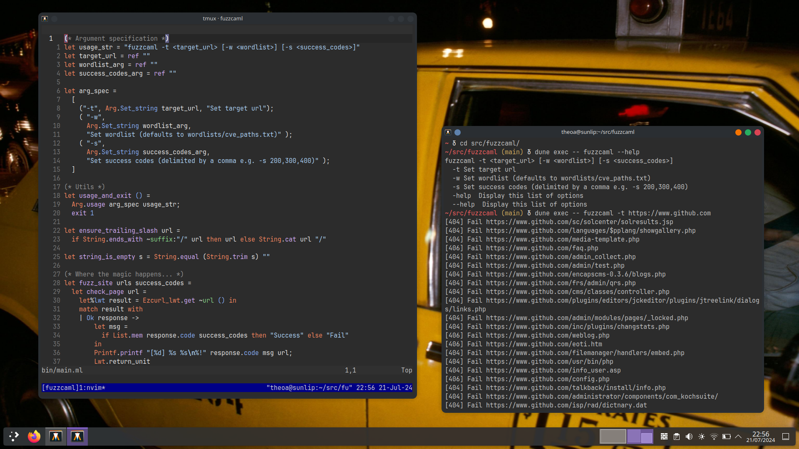

# Fuzzcaml

Asynchronous URL fuzzer built in OCaml with `Lwt` and `Ezcurl`.



[See the code: bin/main.ml.](bin/main.ml)

## What is a URL fuzzer?

A URL fuzzer is a security tool that automatically discovers hidden or unlinked
content on web servers by systematically testing URL combinations. Commonly
used to identify potential vulnerabilities, exposed resources, and map web
application structures, aiding in security audits and penetration testing.

## Usage

```
$ dune build
$ ./fuzzcaml --help
```

```
fuzzcaml -t <target_url> [-w <wordlist>] [-s <success_codes>]
  -t Set target url
  -w Set wordlist (defaults to wordlists/cve_paths.txt)
  -s Set success codes (delimited by a comma e.g. -s 200,300,400)
  -help  Display this list of options
  --help  Display this list of options
```

### Example:

```
$ ./fuzzcaml -t https://www.google.com -w wordlists/cve_paths_short.txt -s 200,202,303
```

```
[404] Fail https://www.google.com/htmlpurifier/htmlpurifier.includes.php
[404] Fail https://www.google.com/class.tx_phpunit_testsuite.php
[404] Fail https://www.google.com/admin/test.php
[404] Fail https://www.google.com/encapscms-0.3.6/blogs.php
[404] Fail https://www.google.com/cms/classes/controller.php
[200] Success https://www.google.com/inc/plugins/changstats.php
[200] Success https://www.google.com/zip/divers.php
[303] Success https://www.google.com/frs/admin/qrs.php
[202] Success https://www.google.com/libraries/dbi/
[404] Fail https://www.google.com/admin/modules/pages/_locked.php
[404] Fail https://www.google.com/filemanager/handlers/embed.php
```
